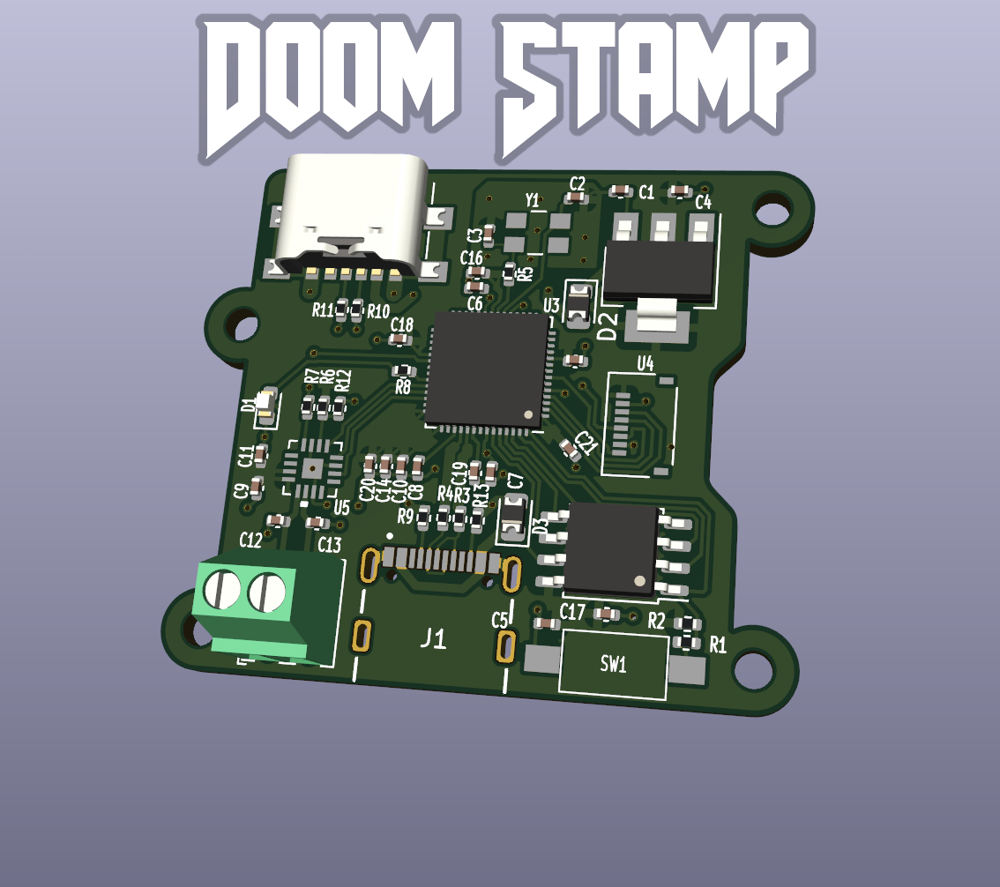

The Doom Stamp was based off the RP2040 [Minimal Design Example](https://datasheets.raspberrypi.com/rp2040/Minimal-KiCAD.zip), and is designed as a platform to make embedded devices that run Doom (or indeed, embedded devices with i2s audio and SPI displays).