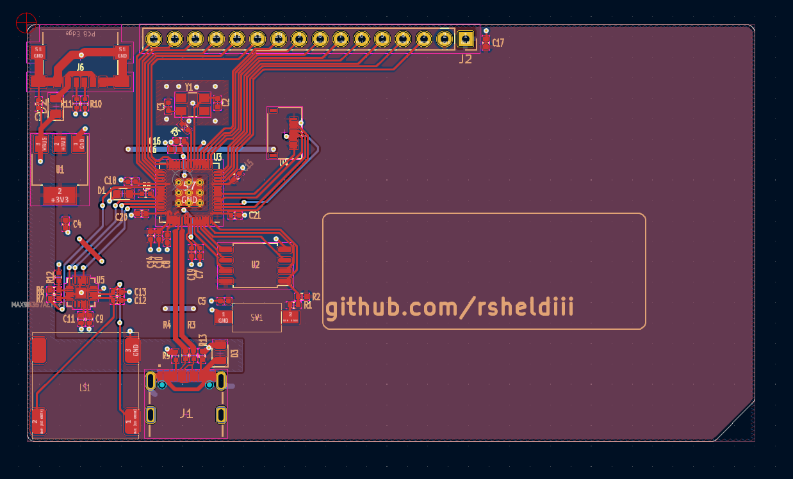

# Doom on a Business Card - and more!

Maybe you're like me, you're mindlessly scrolling through social media and between all the NileRed and LegalEagle shorts you see a video about someone running Doom on their smart fridge or something. You LQTM and keep scrolling, but something's nagging at the back of your brain — why Doom? ow do people even figure this stuff out? And, can I do something like that? I'm here to tell you you can, even if - like me - you don't have a single hardware hacker bone in your body.

# What is Doom? What is "It Runs Doom"?

Let's do some quick housekeeping, just in case:

## What is Doom?

Doom is a popular 1990's shooter game - a boomer shooter, but back when boomer shooters were just called shooters, but also... did Boomers play shooters? Doom came out in 1993, boomers were like 40 years old by then. Anyways, Doom builds off the fundamentals of predecessors like Wolfenstein, featuring a first-person perspective, an arsenal of weaponry and intricate level design. Doom's code was famously open-sourced, and famously well written, which has, in part, led to the proliferation of the "It Runs Doom" meme. If you'd like to learn more about how Doom works, I highly recommend the ["Game Engine Black Book Doom"](https://fabiensanglard.net/gebbdoom/), which goes into much more detail than I would be able to.

## What is "It Runs Doom"?

"It Runs Doom" is a popular [memetic construct](https://knowyourmeme.com/memes/it-runs-doom) where by pure skill or psychotic devotion, a programmer gets Doom running on something it probably shouldn't. Maybe that's a printer, or an ipod mini, or an oscilloscope, or even... a pregnancy test? Well, yes, but also... no. but... kind of?

# What qualifies as "Running Doom"?

I'd argue there are 3 main ways to run Doom on something: 

## Compilation 

The first, and most classic, is via compilation: you upload a program to the device that uses the device's original hardware to interpret and display Doom. Depending on the device, this is easier or harder than you might think; if the device is using a common, powerful consumer chip and has an exposed UART or other debug programming header, it could be about as easy as writing a screen driver. If the device is locked down, or Doom hasn't ever been compiled for the hardware, or you hit memory or space limitations, things can spiral in complexity pretty quickly. At the end of the day though, making Doom run on original hardware breaks down into three high-level steps:

1. You need to gain write access
2. You need to compile doom for the hardware target, taking into account any hardware limitations
3. You need to adapt the display, audio, and input code to use the device's hardware

That's about as much as I'm qualified to explain due to aforementioned lack of hardware-hacking ossicles. There are thousands upon thousands of different types of consumer devices with the capability to run Doom, and probably thousands of people better equipped to explain how to do so, so we'll leave this category to the side for now.

# Display

The second way to run Doom applies to things like dot matrix displays or an oscilloscope: you get Doom running on something _else_ in a way that the display device can interpret. The name of the game here is to find a device that can both play Doom and talk to the display in whatever way the display wants to be talked to, then do both at the same time. That can be very straightforward in the case of a dot matrix display, but can get _very_ complicated - like when running doom on a [stock NES](https://youtu.be/FzVN9kIUNxw). This is not a port, somebody stuck an entire raspberry pi in a NES cartridge and made it spit out code that "tricks" the NES into displaying Doom, which is absolutely insane.

# Creation

The final way to run Doom is to take the original hardware _out_ of the device and run Doom on custom-built hardware _inside_ the device, the most famous example of this being the [pregnancy test](https://www.popularmechanics.com/science/a33957256/this-programmer-figured-out-how-to-play-doom-on-a-pregnancy-test/), but I also made a [keycap](https://github.com/rsheldiii/rp2040-doom-lcd) that runs doom, which is a similar concept, and [this guy](https://youtu.be/o76U0JPrMFk) got Doom running on a LEGO brick in much the same way. 

While this is not nearly the same as hacking Doom onto a printer while sidestepping encryption and sniffing protocols, it's not the soulless copout some people would have you believe. If you make your own device that runs Doom, you'll gain a ton of knowledge about:

* PCB design
* Crystal oscillator circuits
* The USB specification
* miniaturization and efficient trace routing
* Early 90's programming
* And more! 

I'm going to walk you through everything I learned getting Doom to run in a couple of different form factors so that you too can make your own device that runs Doom!

# Creating a PCB that runs Doom

The best way to solve a difficult problem is to remove constraints until you can solve it, then add them back one by one. _Understanding_ a problem mirrors this construction; Using my keycap to demonstrate how to design a device that can run Doom would be confusing, as I was designing for a small form factor. Components are crushed together, traces take 90-degree turns where they really shouldn't take 90-degree turns, the works. I don't want you picking up any more of my bad habits than absolutely necessary, so let's start with something a bit more straightforward, and a LOT bigger: My business card!

I want to stress this is not _the_ business card that runs doom, it is _a_ business card that _can_ run doom. it can also run a NES emulator and lots of other things too, and has a handy set of GPIO pins at the top. Despite the larger form factor, the circuit is fundamentally the same, just all on one side and much easier to follow.

# Prototyping

But, how did we get here? How did we go from saying "I want to run Doom on my X" to having an X that runs Doom?

Well, step 0 is to have somebody else do it first. Graham Sanderson from the Raspberry Pi foundation wrote a _fantastic_ port of Choco Doom As part of the promotional material for the RP2040. Graham jumped through an amazing amount of hoops to get Doom running on the RP2040, like optimizing WAD file size by over 50% and writing some assembler PIO code to output to VGA, which can be displayed via HDMI. I took Graham's code and built off of it by uh... very carefully ripping out some of those optimizations, and implementing some generic SPI/I2c screen support. if you'd like to learn more about the crazy stuff graham did in his port, I highly recommend his detailed rundown on his [github page](https://kilograham.github.io/rp2040-doom/).

So after step 0, step 1 is to prototype. This mess of wires:

is actually my original prototype, and believe it or not, it still works! Prototyping is all about the loop: 

* Get to a known good state, then
* Implement a new feature (and inevitably break the build)

then repeat. For this project, that meant flashing the firmware in the first place, then getting just the LED blinking every frame, then unwinding the DVI linebuffer code in favor of a generic SPI / I2c interface. The actual process for this step is very boring, and I've already done it for you, so we'll move on from here.

So now we've got our prototype working, Doom is playing on a Raspberry Pi Pico hooked up to an Adafruit amplifier board (more on that later) and an OLED breakout. I could have made a carrier board for all these devices, slapped my name and email on it and called it a day; that's definitely a business card, and it would definitely run Doom. But we'd be wasting a lot of the potential of the pico with it's 26 I/O pins, it'd be impossible to make small enough to fit in a keycap, and also that's pretty underwhelming.

So, If we wanted to make our own, custom board, what would it need to "run" Doom? like, what components from the ones we've already assembled are necessary for that purpose?

# Component Requirements

### Processor

For starters, you need a processor, and we've got ourselves covered with the Raspberry Pi RP2040. Featuring a dual-core Arm Cortex m0, 264KB of SRAM, and support for up to 16MB of flash... it doesn't seem like it's big enough, does it? I mean, it's way fast enough, but I'll be forever in awe of how Graham got doom running on a 16th of the original RAM requirements. We could use the new RP2350 here - in fact Doom would run even better - but I'll be damned if I can find the bare MCU anywhere...

### Crystal Oscillator

but what else do you need to run Doom? Well, the RP2040 _needs_ a crystal oscillator... sort of. Every microcontroller needs at least one oscillator to run the clock, but the RP2040 already has an oscillator, it just kind of sucks. it's there for boot initialization, but it's accuracy is terrible, literally between 1.8 and 12MHZ. You can physically run the RP2040 without an external crystal, and the rp2040 might crunch the numbers that could theoretically put Doom on a screen, but you'd have to clock an i2c screen way, _way_ down to get anything to show - we're talking a couple FPS at most. So in any case, in our circumstance, we absolutely need an external crystal oscillator.

### Flash

You also need a flash chip, so you can store Doom. Think of flash as the hard drive of the microcontroller. When compiled for the rp2040, the game code itself is only about half a megabyte, but remember how I said Doom was open-source? well, Doom the _engine_ is open source, but doom the _game_ is not, and clocks in at around 11 megabytes. Graham's compression algorithm cuts that in more than half if you remember, so you're fine with 8 megs of flash. The rp2040 is kind of particular about flash chips? we'll get to that later.

### Power

You'll need power as well, obviously. If you're not worried about efficiency, power can be pretty simple; we're going to use an LDO, or low drop-out voltage regulator, to get the RP2040 the 3.3 volts it needs from the USB lines. You could use a buck converter for higher efficiency but they usually require more support components, so we'll stick with the LDO for now.

### Is that it?

Now, some very select people might argue that you could stop here. You power the system, the microcontroller uses the crystal to communicate at high speeds with the flash chip, pulling the information it needs to run Doom - it just... doesn't display it anywhere. A younger me would argue this is sufficient - if I unplug my monitor, does my computer stop running? When I unplug the screen from my business card, each flash of the LED is another frame rendered into the ether. Is it not "running" Doom? 

But that's not really what we mean when something "plays" doom. Video games are multi-sensory, interactive experiences, if you can't _play_ a game, is it really a game at all? To that end, we need three more things: we need a screen, we need some way to input commands, and we need audio.

### Screen

Now, there are _hundreds_ of ways to add a screen to a raspberry pi. The proliferation of smart devices has ensured that aliexpress and its ilk are absolutely ensconced in a crusty layer of mini TFT and OLED screens. I found a couple SPI screens that use the same ribbon cable, meaning I can run either of them with a single footprint, but if you're willing to implement a screen driver you can use whatever you want - provided you can drive it fast enough. Whatever screen you get, make sure there's at least a good data sheet on the screen controller, or even better, a screen driver already implemented somewhere.

### Audio

For audio, I'm using an i2s amplifier. Why i2s you ask? That's uh... that's what Graham was using. The amp I'm using is in the same family as the Max98357 audio amplifier. Why _that_ audio amplifier you ask? Adafruit had a nice circuit diagram for it! In all seriousness though, the audio was already implemented, and there's a very popular, very standard amplifier that works great, so why change things? Just take the win.

### Input

Speaking of wins, for input I'm sticking with the USB input that's already implemented. You could certainly add a set of buttons that trigger of GPIO pins with some interrupts that set a bitmask that you key in to blah blah blah. Or, you could just use the USB communication that's _already implemented_, and let people use a nice, full-size keyboard for control input - or a trackball, like [this guy did](https://github.com/arkadijs/rp2040-doom/tree/rp2040-mipi)

# How was I supposed to know all that?

So that covers all the components needed to run Doom, but you might be asking, how was I supposed to know I needed all these things in the first place? Like, a 12mhz crystal oscillator? what? 

Let me introduce you, my friends, to the [RP2040 datasheet](https://datasheets.raspberrypi.com/rp2040/rp2040-datasheet.pdf). Calling it a datasheet is a bit of a misnomer: this thing is a tome. I'm pretty sure if you read this thing front to back you become a technomancer. The rp2040 datasheet is chock full of fantastic information about how the RP2040 runs and how to interact with the chip once you've got it up and running. It's where I learned about the internal oscillator, the UART debug mode, and very importantly, the [_minimal design example_](https://datasheets.raspberrypi.com/rp2040/Minimal-KiCAD.zip):

The _minimal design example_ is a reference implementation of an RP2040-based microcontroller. It's not the best microcontroller out there - it doesn't even have a status LED - but it's the bare minimum components required to get the RP2040 running stably. 

If you take a look at the pcb, you'll notice the crystal oscillator circuit looks fairly similar to the circuit on my board as well - that's because I just straight up copy-pasted it into my design (and modified it slightly). That might feel like a cop-out, but hardware manufactures, really, _really_ want you to use reference designs. They spend significant amounts of time and effort designing their chips and testing the physical and electrical properties of their devices, they'd _really_ prefer you just stick to the reference designs so the chip works just as it should. Fun little side note, the Raspberry Pi foundation actually [got burnt](https://arstechnica.com/gadgets/2019/07/raspberry-pi-4-uses-incorrect-usb-c-design-wont-work-with-some-chargers/) by not following reference designs in the past with one of their USB-C chargers, so even large companies are fallible to design mistakes.

# Introducing Kicad

OK, so we've got a reference design to base our PCB off of and the list of parts we're going to use, but how do we actually _use_ the reference design to design our PCB? Well, the reference design is a Kicad project, which happens to be a free PCB design software! Learning how to use kicad is it's own topic, and I'm not very qualified to teach it, but I learned by watching the "Getting To Blinky" series by [Contextual Electronics](https://www.youtube.com/watch?v=BVhWh3AsXQs&list=PLy2022BX6EspFAKBCgRuEuzapuz_4aJCn). Those tutorials have not been updated since Kicad 5, but there really hasn't been that much groundbreaking stuff between 5 and 7, so they're still a good watch. 

A nice thing about Kicad is the circuit and schematic designs are separate - you can lay out a circuit that performs a particular function, then link circuit symbols to schematic footprints. Once you switch to the PCB editor, those schematic footprints are linked together with what's called the "rat's nest", which correctly link together the pins of the components you laid out in the circuit diagram. neat!

Now that we have our EDA and a couple reference designs to base our components off of, we'll use the designs and the datasheets for the components to create a circuit for our custom board.

# The Circuit

While we're here, let's quickly go over some parts of the schematic that might be confusing. I'm **absolutely** not an electrical engineer, I just cosplay as one on the weekends, so take my advice with a grain of salt, but hey, the thing works so...

## Power

Up in the top you'll see the power circuitry. This stuff is dead simple and mostly borrowed from the reference schematic. One thing to call out here are the resistors - these are required for the USB-C spec, and you need _both_ of them so the plug can orient itself. Could you use one resistor and have the device still work? Probably, but I'm not in the business of probablies, go talk to the horseshoe company or whatever.

## Crystal Oscillator

Down below power delivery is the crystal oscillator. My advice is to use the reference crystal and just _never touch this part of the circuit again_. Crystal oscillators are effectively black magic, they are crazy susceptible to noise and other issues, if you get it working just leave it alone. It's actually so common to have a crystal that needs extra time to stabilize that there's a build variable - PICO_XOSC_STARTUP_DELAY_MULTIPLIER - that does so. If the reference crystal is out of stock try to find the most comparable crystal, follow the datasheet's recommendations for resistance and capacitance, stitch a healthy ground plane away from high-speed signals, enable the build variable and cross your fingers.

## Flash

After the crystal is the flash circuitry, which is ripped right out of the reference schematic. I would highly recommend staying within the same family of Winbond flash chips when you design your circuit, as the rp2040 is a bit picky about what chips it will talk with; I know the people over at [Digi-key's youtube channel](https://youtu.be/kcwvuwetgEQ?t=2979) had some trouble in this department, though that is still an excellent video to watch if you want a more general look at hardware development for the RP2040. 

## Audio

Looping around, we have the amplifier circuitry. This is very similar to Adafruit's Max98357 schematic. All resistor values were determined by looking at the data sheet to give us 9db of gain and a 50/50 mono output. It's worth noting that the Max98357 is a speaker amplifier, not a headphone amplifier; it might work with some really dinky headphones, but if you wanted a headphone-based system, you should be looking at a headphone amplifier instead.

## Screen

Making our way up here, we finally get to the screen. Schematically there isn't much to talk about here - like most small screens, the screens I'm using have their own drive circuitry, so we're really just connecting pins to bare pins here. Swapping to a new screen would require reviewing the screen's datasheet and rejiggering the connections here. The RP2040 is pretty unique in that the I2c and SPI pins can be one of many sets of pins across the board, so you can be pretty flexible with where you place the screen when designing the PCB.

## USB

Down at the bottom, we find ourselves at the USB hookup. The 27 ohm resistors (not shown) are required by the USB spec, the 56k resistors are the opposite of the resistors on the power usb - they indicate to the devices connected to the bus that we are an upstream-facing-port, and peripherals can expect power from us, since we need to power the keyboard. 

## Decoupling caps

Finally to round us off here, we find all these capacitors up at the top. These are decoupling capacitors, which are capacitors placed next to integrated circuits to absorb weird voltage spikes and dips, decoupling them from other stuff that's going on in the board. these decoupling caps are to be placed next to _every_ 3v3 pin on the rp2040. Lastly we have this LED hooked up to GPIO25 as a status LED, which is _very_ helpful if you can't get a debug session working.

# The PCB

So now we've got the entire schematic laid out, and all we have to do is turn that into a PCB! In Kicad this happens in a two-step process: first, you agonizingly collect all the footprints for your selected components, scrutinizing and painstakingly fixing any mistakes made by the conversion program that spit them out, and then you lay them all out in PCBNew and connect everything up! When I say agonizingly, I do mean _agonizingly_; I have not figured out a good way to do this. There are dozens of sites that claim to be a one-stop shop for all your eda footprint needs, but every one I've tried suffers from some sort of problem. Whether it's something mundane like terrible inventory, to something more systemic like whatever the heck Mouser's got going on, they all have their faults. For now I've settled on UltraLibrarian, which has a good set of footprints, and sometimes even 3d models, but the pins don't always make sense.

Once you have all your footprints downloaded, imported, and associated, you can start designing your PCB:

The blue lines are the "rat's nest" we talked about earlier. Your job is to eliminate all of these blue lines while following common PCB design rules and the constraints put on you by the fab. Then you run the design rules checker and do whatever it says - within reason. It's almost a game really, and real EEs are _much_ better at it than I am. But, this is what I came up with:

Power is in the top left, with audio at the bottom left, input at the bottom, flash at the bottom right, the screen top right, and finally the crystal oscillator (and GPIO) at the top. You can see that the USB lines are straight and impedance matched, we've got a nice, stitched ground plane under the crystal oscillator and the trace runs for most components are pretty short. I can already see one sin I committed, I put the 27ohm resistors for the USB lines at the USB connector, when they should be closer to the RP2040. However, "Closer" is a relative term, and we're super over-engineering this dinky lil USB bus here, so we'll be perfectly fine. That goes for the impedance and length matching as well.

# Fabrication

Now we've got a PCB that runs Doom in theory, but how do we get a PCB that runs doom... in practice?

well, you send your design to a fab! Each fab has their own rules and constraints listed on their website, sometimes with step-by-step tutorials on how to configure your EDA for their service; it's a good idea to run through these and make sure your board complies. Shoutouts to [OSHPark](https://www.oshpark.com) here who are a pretty phenomenal, US-based fab. I use them for prototyping as they don't have a minimum price. Plus, you can upload your Kicad project directly to them instead of having to generate gerber files! You have to buy stencils on a separate website but they are reasonably priced and even have a neat lil' import button. You're gonna _need_ stencils by the way, unless you can hand-solder a QFN56.

# Assembly

Once you've got your boards back from the fab, it's time for assembly. Since we built our boards around an rp2040, that means we basically have to do reflow soldering, which involves using a stencil to spread solder paste onto a pcb, placing components on the solder blobs and then "reflowing" that solder to stick the parts on the board. 

There are some tricks you can do to make this easier. Remember when I said my business card has all the components on the same side? That means I can use this little hot plate:

 to reflow 100% of the components with a single stencil. You can also use as many hand-solderable components as you can get your hands on, keeping all the non-hand-solderable components on the same side of the board. This again lets you only reflow with a single stencil, just with a little extra soldering afterwards.

I gotta be honest, even with these tricks I'm not great at this. It's best to get the solder all in one smooth motion but I always need to come back and do another go-round. Luckily you can still do some manual fixup if your solder job is uh... less than ideal.

Counter-intuitively, I find that power is everything when you're doing fixup drag-soldering like this. The more amps your soldering iron can push out, the better. My Hakko FX888D is a little beefier than my Pinecil and that makes all the difference in how easy it is to fix solder bridges. Also be sure to select a tip that can actually get into the space between the PCB and the component!

# Flashing / Programming

OK, you're now the proud owner of a custom-built PCB. Nobody else in the _world_ has a device like this in their hands, which can be kind of daunting. Like, forget Doom, how do I even get _any_ program on this device?

Luckily that's pretty easy, you boot the sucker up and press the boot button and wham bam thank you mam, bob's your uncle bessie's your aunt, you've got a USB mass storage device you can _copy_ your program onto! I cannot tell you how much of a mind-blown moment I had the first time I plugged in a Raspberry Pi Pico and saw this. This USB firmware is _embedded into the board_, it's basically impossible to brick. It's amazing. I'm so sick of programming headers and weird little boot rituals and all that junk, I want every microcontroller to use this bootloader.

The first program you should chuck on your PCB is the led blink example from the rp2040 datasheet, but that's boring, so we're going to head on over to the rp2040-doom-lcd github page and download us some Doom firmware. If you don't have your own PCB that's ok, there are a couple off-the-shelf boards that are supported as well, like the [Lilygo TT-Go T-display](https://www.aliexpress.us/item/3256803094729227.html), or these tiny little unnamed [0.42 inch RP2040 boards](https://www.aliexpress.us/item/3256805864747243.html). If you find another board that uses one of the [supported screens](https://github.com/rsheldiii/rp2040-doom-LCD/tree/rp2040/src/pico/pico-screens/screens), it should be relatively simple to get it up and running as well.

So you download your uf2 file, put your PCB into boot mode, chuck that sucker in the folder aaaand... nothing? well, _almost_ nothing. you should see the LED flash just a tiny bit when you plug things in, which probably indicates that you forgot to place the level code in memory. For testing purposes you can download the shareware version of doom free of charge. to grab the full game file, the easiest way is to pay for it on Steam; the 1-800 number the shareware file gives you is out of order, unfortunately. Once you've followed the instructions about how to shrink and load the level file into memory using picotool, _now_ you're ready for the moment of truth. 

And that's it, you got Doom playing on a custom PCB! It can be a little finnicky with what keyboards it'll allow to be connected to it, but once you do you have full control over the game. My spi / i2c code does not use DMA, but I haven't found any framerate issues; if you're implementing a larger display and having some trouble, that would be a good place to start. 

# What's next?

So where do we go from here? Well, a million different places, honestly. You could add a bluetooth chip and play with a game controller, or make the first electric gloves that run Doom, make a GPIO add-on for the flipper zero, or any number of different things. You'll need a PCB to use / modify though; unless you were following along, that's probably not in your possession right now. I don't want you to start from scratch, but I also don't want to just give out the files for my business card since it would be trivial to delete my name and slap someone elses in there. I'll do you one better by releasing this board:

I'm calling it the Doom Stamp. It's got:

* The same circuit as my business card in a very compact form factor (Status LED, separate power / data USB, boot button, optional power diodes, etc etc)
* 2-layer, 1-sided board for easy fabrication
* M2 mounting holes 
* A nice screw terminal for connecting external speakers

The Kicad files are available in [this repository](https://github.com/rsheldiii/rp2040-business-card). Note that while the schematic is functionally identical and all components (save the speaker) remain the same, this exact pcb has *NOT BEEN TESTED* yet; I have boards on the way.

If you just want to play around with a tiny board built to run Doom, feel free to send the Kicad pcb file off to OSHPark (3 boards are ~$10) or generate your own gerbers. If you want to use my design as a starting point for your own creation, by all means!

# BOM shenanigans

You can generate the BOM in the schematic editor; there are also pre-generated BOMs at the base of the Kicad project. A few things to note:

### Crystal

The crystal is **NOT** the reference crystal, as they were out of stock when I made the original circuit. The crystal I used is [this one](https://www.mouser.com/ProductDetail/774-403C35E12M00000), though case-compatible 12mhz crystals will work in the circuit as long as you tweak the support capacitors.

### MCU

It's weirdly difficult to find RP2040 MCUs on Mouser, but they are [here](https://www.mouser.com/ProductDetail/358-SC091413)

### Flash

use the flash specified in the RP2040 datasheet

### Audio

find whichever Max9835x is in stock and double check via the datasheet that it's a drop-in replacement for the Max98357.

For the speaker terminal, the BOM csv has the part number (I haven't purchased it yet, so I don't have the link). You could also elect not to fill this component, and directly solder speaker wires, either way.

### Voltage Regulator

the voltage regulator I used was [this one](https://www.mouser.com/ProductDetail/onsemi/NCV1117ST33T3G?qs=8sOby8ZxZLHgqg5CFzeqiA%3D%3D), but I'd certainly look for comparable LDOs that are cheaper

### Screen / Screen FPC

the screen FPC I used is [this one](https://www.mouser.com/ProductDetail/TE-Connectivity/2328702-8?qs=w/v1CP2dgqphyFkupQxKkA%3D%3D). This FPC interfaces with two SPI displays that I know about. I purchased them from [this link](https://www.aliexpress.us/item/3256803794221438.html?gatewayAdapt=glo2usa), the 0.96 and the 1.14 inch version (the 1.14 being showcased in this document, as it is bigger and has much better colors). There may be other screens that work, though the code will need to be modified. 

### Boot Switch

the component photo is of a white switch, but the boot switch is [this one](https://www.mouser.com/ProductDetail/611-PTS636SL50SMTRLF)

### USBs

the two USB components used are [here](https://www.mouser.com/ProductDetail/640-USB4135-GF-A) and [here](https://www.mouser.com/ProductDetail/640-USB4105-GF-A-060)

### USB Diodes

the USB diodes are DNF; they would theoretically provide protection for the USB circuit and enforce power direction, but they're a little difficult to come by at the power I chose for the LDO. You'll need to bridge these pads, either with a wire, a 0-ohm resistor that's compatible with the footprint, or just solder. You could also use a regulator with less capacity and thus easier-to-find supporting diodes. Note that with the diodes installed, you need to provide separate power when programming the device, as the bottom usb will only be used for communication. 

# Does it _really_ play Doom though?

Indeed, so far throughout this document, I haven't provided any proof that the business card actually works. For posterity, I play the first level of Doom on the business card [here](https://youtu.be/YhjtOR5cU4k). Is that enough proof? what if I'm beaming a video of Doom via the USB port? I guess that means to _really_ prove it, you'll have to assemble a Doom Stamp and try it out for yourself.

# That's it

That's all, thanks for reading!